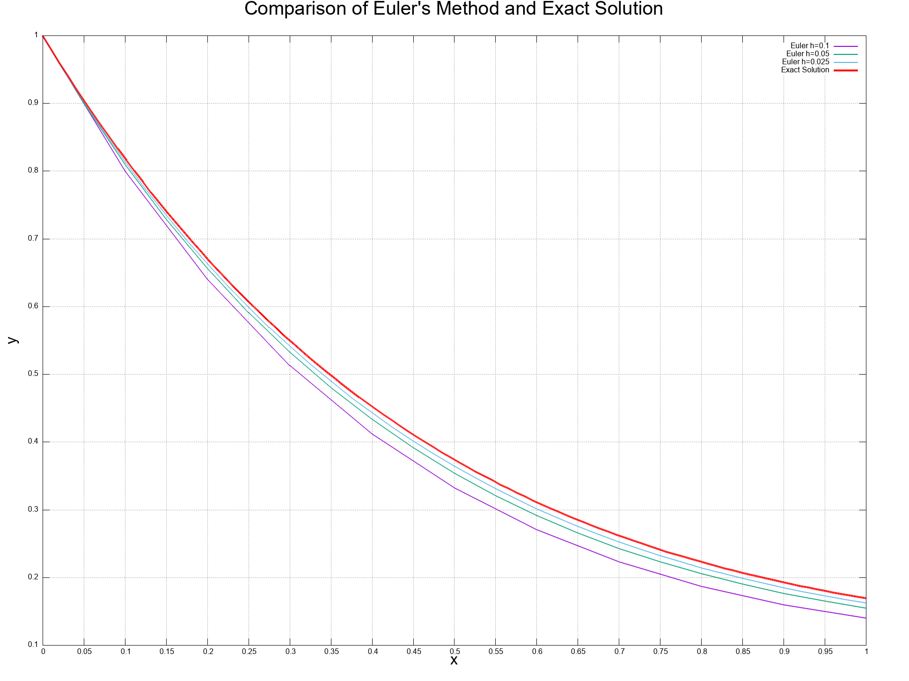
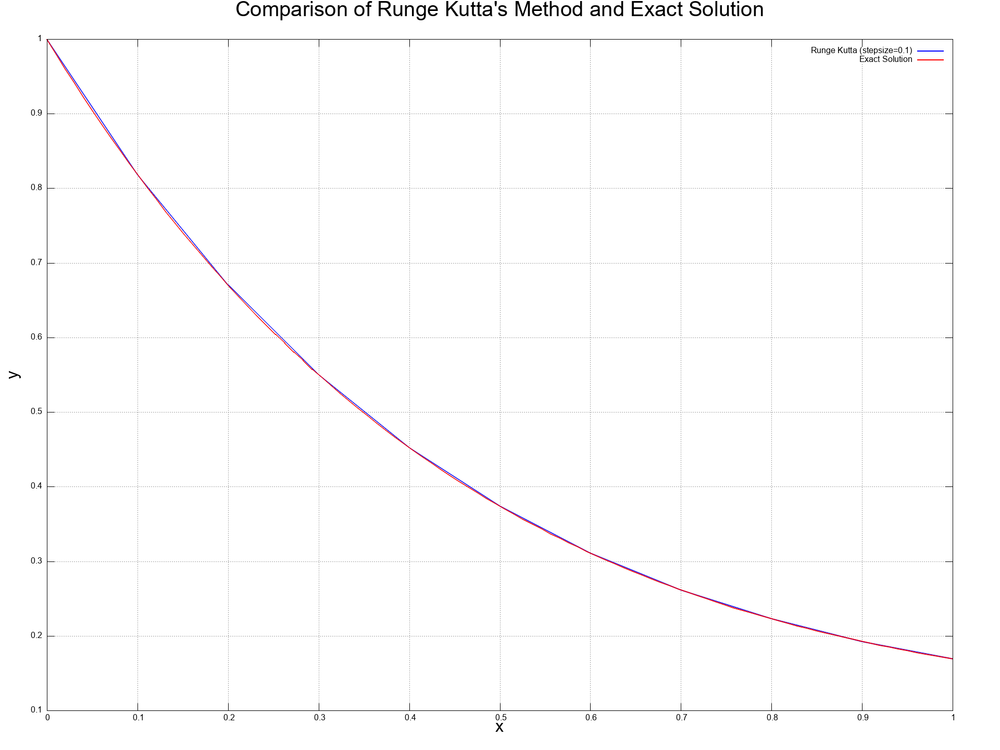

# Week 1: Numerical Techniques in Physics

Welcome to the Week 1 report for **Numerical Techniques in Physics**. This README provides a detailed overview of the problems solved, methods used, observations made, and results obtained during the first week.

---

## **Problem 1: Setting Up Environment**
### Task:
- Set up **C++** as the primary programming language and **GNUplot** for visualizations.
- Installed tools:
  - **VS Code**: IDE for coding and debugging.
  - **GNUplot**: For plotting graphs.

### Learnings:
- Understood the basics of plotting tools for numerical computations.

---

## **Problem 2: Newton-Raphson Method**

### Method Overview:
- Formula used:
  x_(n+1) = x_n - f(x_n) / f'(x_n)

- Derivation involves Taylor expansion to approximate \(f(x)\).

### Task 2.1:
Find a root of the equation x^2 - 8x + 11 = 0 to 5 decimal places using the initial guess x_0 = 6.

#### Formulation of the Problem
1. **Equation to Solve**:  
   The function for which we find the root is: f(x) = x^2 - 8x + 11

2. **Derivative**:  
   The derivative f'(x) is: f'(x) = 2x - 8

#### Results:
- Converged root: **x = 6.23607**
- Number of iterations: **4**

### Task 2.2:
The circle has a radius of 1. The longer circular arc joining points **A** and **B** is **twice as long** as the chord **AB**. The task is to determine the length of the chord **AB**, accurate to **18 decimal places**.

#### Formulation of the Problem
1. **Arc-Chord Relationship**:
   The length of the longer arc joining **A** and **B** is given by: L_{arc} = 2L_{chord}  

2. **Geometric Representation**:
   Let the angle subtended by the chord **AB** at the center of the circle be &theta;. The relationships are:  
   - Major Arc length: L_{arc} = 2&pi;R - &theta; = 2&pi;-&theta; (since R = 1).
   - Chord length: L_{chord} = 2R * sin(&theta; / 2) = 2 * sin(&theta; / 2).  

3. **Equation for Newton-Raphson**:  
   Combining these, the equation to solve becomes: f(&theta;) = 4 * sin(&theta; / 2) + &theta; - 2&pi; = 0

4. **Derivative for Newton-Raphson**:  
   The derivative f'(&theta;) is: f'(&theta;) = 2 * cos(&theta; / 2) + 1

### Key Observations and Insights:
- The method’s quadratic convergence ensured rapid results.
- Precision was achieved efficiently within a few iterations.

---

## **Problem 3: Secant Method**
### Task:
Find the root of f(x) = e^{2x} + x - 5 using the secant method with initial guesses x_0 = 0 and x_1 = 1.

### Method Overview:
- Formula used:
  x_{n+1} = x_n - (f(x_n)(x_n - x_{n-1})) / (f(x_n) - f(x_{n-1}))
- Unlike Newton-Raphson, it does not require explicit derivatives.

### Results:
- Converged root(precise to 2 decimal places): **x = 0.73**
- Number of iterations: **5**

### Key Observations and Insights:
- Secant method converges slower than Newton-Raphson.

---

## **Problem 4: Euler Method**
### Task:
Solve the initial value problem:
y' + 2y = x^3e^{-2x},  y(0) = 1
using step sizes h = 0.1, 0.05, 0.025.

### Method Overview:
- Derived from the first-order Taylor expansion:
  y_{n+1} = y_n + h * f(x_n, y_n)
- Accuracy improves as the step size decreases.

### Results:
| Step Size (h) | Approximation (\(y(1)\)) | Exact Solution | Error (%) |
|---------------|--------------------------|----------------|-----------|
| 0.1           | 0.1398                   | 0.1692         | 17.4      |
| 0.05          | 0.1547                   | 0.1692         | 8.56      |
| 0.025         | 0.1620                   | 0.1692         | 4.25      |

### Graphs:
- A combined plot of all step sizes and the exact solution was created to visualize accuracy improvements.

### Key Observations and Insights:
- Step size plays a critical role in balancing computational efficiency and accuracy.
- Smaller step sizes significantly reduce error.

### Challenges Faced:
- Balancing precision with computational cost.

---

## **Problem 5: Runge-Kutta 4th Order Method (RK4)**
### Task:
Solve the same initial value problem using the RK4 method.

### Method Overview:
- Formula used:
  y_{n+1} = y_n + (h / 6) * (k_1 + 2k_2 + 2k_3 + k_4)

  Where:
  - k_1 = f(t_n, y_n)
  - k_2 = f(t_n + h/2, y_n + h/2 * k_1)
  - k_3 = f(t_n + h/2, y_n + h/2 * k_2)
  - k_4 = f(t_n + h, y_n + h * k_3)
- Intermediate slopes (k_1, k_2, k_3, k_4) computed to refine accuracy.
- Derived by Taylor expansion of y as single variable(x) function and y' as double variable(y,x) function

### Results:
| Step Size (h) | Approximation (\(y(1)\)) | Exact Solution | Error (%) |
|---------------|--------------------------|----------------|-----------|
| 0.1           | 0.169174                 | 0.169169       | 0.003     |

### Graphs:
- Combined plot comparing RK4, and the exact solution.

### Key Observations and Insights:
- RK4 offers better accuracy than Euler for the same step sizes.
- Computational cost is justified by significantly lower error.

---

## **Problem 6: Solving Linear Systems (Jacobi & Gauss-Seidel Methods)**
### Task:
Solve the linear equations system using iterative methods.
4x - y - z &= 3
-2x + 6y + z &= 9
-x + y + 7z &= -6

### Observations:
- **Jacobi Method**: Converged in **13 iterations**
- **Gauss-Seidel Method**: Converged in **7 iterations**

Solution: 
* **x** = 1.000001  
* **y** = 1.999999  
* **z** = -1.000001  

### Key Insights:
- Gauss-Seidel converges faster due to sequential updates.
- Code was generalized for larger systems, preparing for future use in higher dimensions.

### Note:
- These methods are used for determining the solutions of a strictly diagonally dominant system of linear equations,
A matrix `A = [a_{ij}]` is diagonally dominant if:

|a_{ii}| ≥ Σ_{j=1, j != i}^{n} |a_{ij}|  for all i = 1, 2, ..., n.

---
